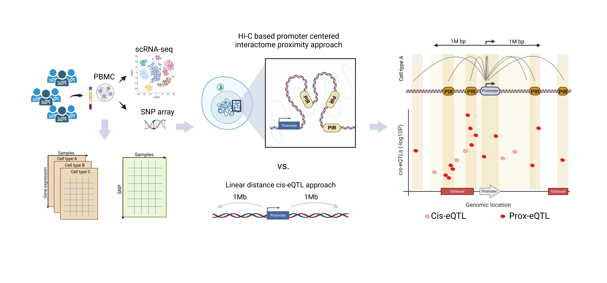

# ProxSeek

# Introduction

The R package "ProxSeek" is designed to revolutionize genetic analysis by leveraging publicly available Hi-C data to construct promoter-promoter interaction information. This innovative tool is specifically tailored to aid in the identification of proximal expression Quantitative Trait Loci (prox-eQTLs). By mapping these eQTLs, researchers can gain valuable insights into the genetic architecture of gene expression regulation. Furthermore, ProxSeek offers a unique advantage in prioritizing cis-eQTL Single Nucleotide Polymorphisms (SNPs), focusing on those spatially proximate to gene promoters. This feature is particularly useful for geneticists and molecular biologists in unraveling the complex interplay between genetic variants and gene regulation.

# Installation

* Install latest development version from GitHub (requires [devtools](https://github.com/hadley/devtools) package):

```r
if (!require("devtools")) {
  install.packages("devtools")
}
devtools::install_github("jaleesr/ProxSeek", dependencies = TRUE, build_vignettes = FALSE)
```

# Documentation and Demo Scripts

Instructions, documentation, and tutorials can be found at:

+ [https://jaleesr.github.io/ProxSeek](https://jaleesr.github.io/ProxSeek/)


A PDF manual [ProxSeek_1.0.0.pdf](./ProxSeek_1.0.0.pdf) can be found in the repository.


# ProxSeek Framework Overview





# Some highlights of using **ProxSeek**.

Some quick examples to show how to use **ProxSeek**.

### 1. Prioritizing cis-eQTLs using promoter interactome 

```r
library(ProxSeek)
demo.ciseqtl.file<-system.file("data", "ciseqtl.csv", package = "ProxSeek")
demo.ciseqtl.file
demo.P.PIR<-system.file("data", package = "ProxSeek")
demo.P.PIR
list.files(demo.P.PIR) # you should see a list of P_PIR_cell.csv files

result <- ProxSeek_selectProxCis(ciseqtl.file = demo.ciseqtl.file, P_PIR_folder = demo.P.PIR, cell.type = "Mon", n.cluster = 4)

```

### 2. Identify prox-eQTLs from scratch

```r
result <- ProxSeek_runProxeQTL(SNP_file_name = SNP_file_name,expression_file_name = expression_file_name,snps_location_file_name = snps_location_file_name,gene_location_file_name = gene_location_file_name,covariates_file_name = covariates_file_name, cell.type = "Mon", chr = 19,
                               output.file = output.file, n.cluster = 10, P_PIR_folder = demo.P.PIR)
```


